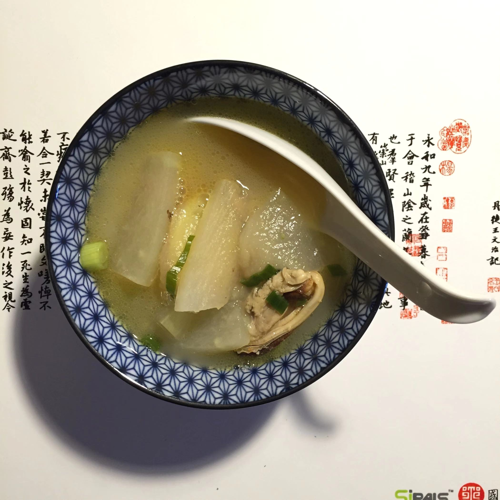

# 淡菜冬瓜枸杞汤

## 食材

淡菜，冬瓜，姜片，油，葱

## 做法

1. 从冷藏室拿出淡菜，泡凉水解冻， 洗净
2. 冬瓜洗净，削皮，切片，姜切片
3. 炒锅热锅冷油加热，放入姜片爆香
4. 放入淡菜，大火翻炒
5. 放入冬瓜片，大火继续翻炒
6. 加适量汤水，大火继续烧，烧开后放入枸杞，放盐调味，转小火继续烧汤
7. 味道适当后加葱，关火，起汤

## 注意

## 参考

[回到杨记美食](../README.md)