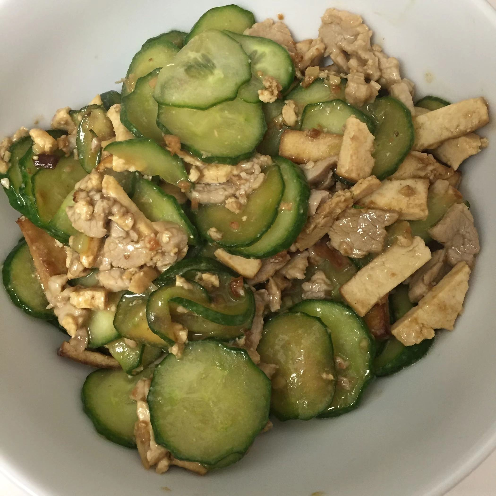

# 黄瓜肉片炒香干

## 食材

黄瓜，猪肉，豆干，油，酱油，盐，姜，蒜，料酒

## 做法

1. 香干洗净切丝，黄瓜洗净切片，猪肉切丝，准备姜末，姜丝，蒜片
2. 将黄瓜用开水焯水，捞出待用
3. 锅内放油烧热，加姜末，葱末爆香，入肉炒至变色
4. 入香干，翻炒片刻至表面变黄
5. 入姜丝，入酱油，翻炒均匀
6. 入黄瓜片，翻炒片刻，入盐，蒜片，料酒，翻炒至熟

## 注意

## 参考

[回到杨记美食](../README.md)